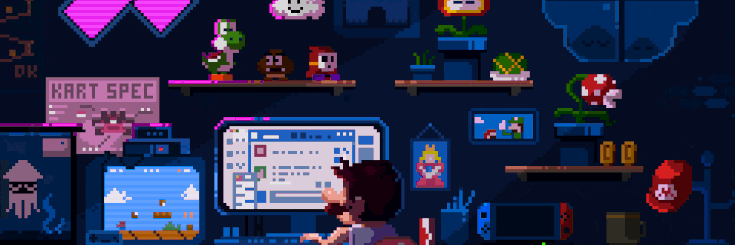

  

## Hai Kawan 👋
---

<!-- 
 -->
<!--  -->

---

## 📝 **About Me**

Saya hanyalah seorang programmer biasa yang ingin jadi handal, tapi kenyataannya kadang mager banget ngoding. Walau begitu, rasa penasaran buat bikin hal-hal keren masih terus membara (walau sering nunggu mood dulu 😅).

Saya suka ngulik Python dan JavaScript — bahasa serba guna yang bikin eksperimen coding terasa fun. Dari proyek iseng, sampai tools sederhana buat produktivitas, saya percaya bahwa proses belajar yang menyenangkan itu lebih penting dari hasil cepat.

> "Ngoding santai, tapi tetap jalan. Yang penting ngulik, bukan buru-buru jago."

> 🌱 Saat ini lagi ngulik [**Python**](https://www.python.org/) dan [**JavaScript**](

---

### 📚 Skills Language And Framework

  
  
  
  
  

---

### 🌐 Sosial Media

  
  
  

---

### 📈 **Statistik GitHub Saya**

  <!--  -->
  
  

---

### 🎵 Spotify Recently Played

  

---

## 📩 **Kontak**

  
  

---

### 🐍 Play with me

---
